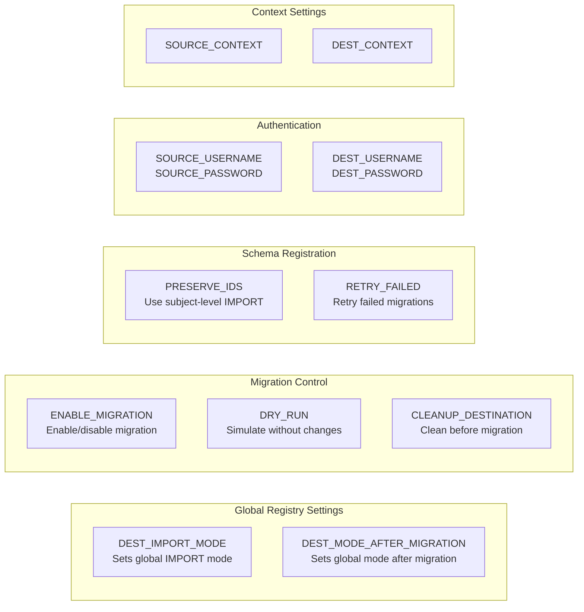
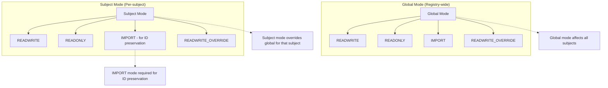
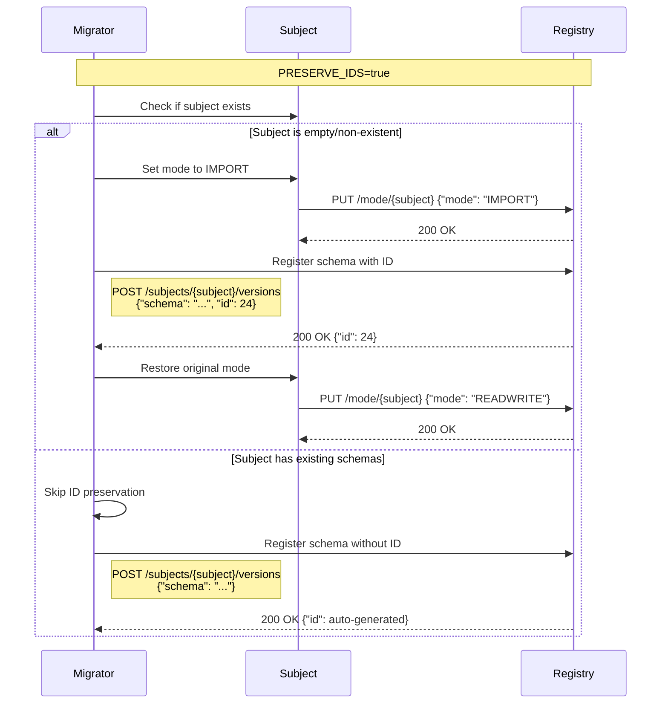
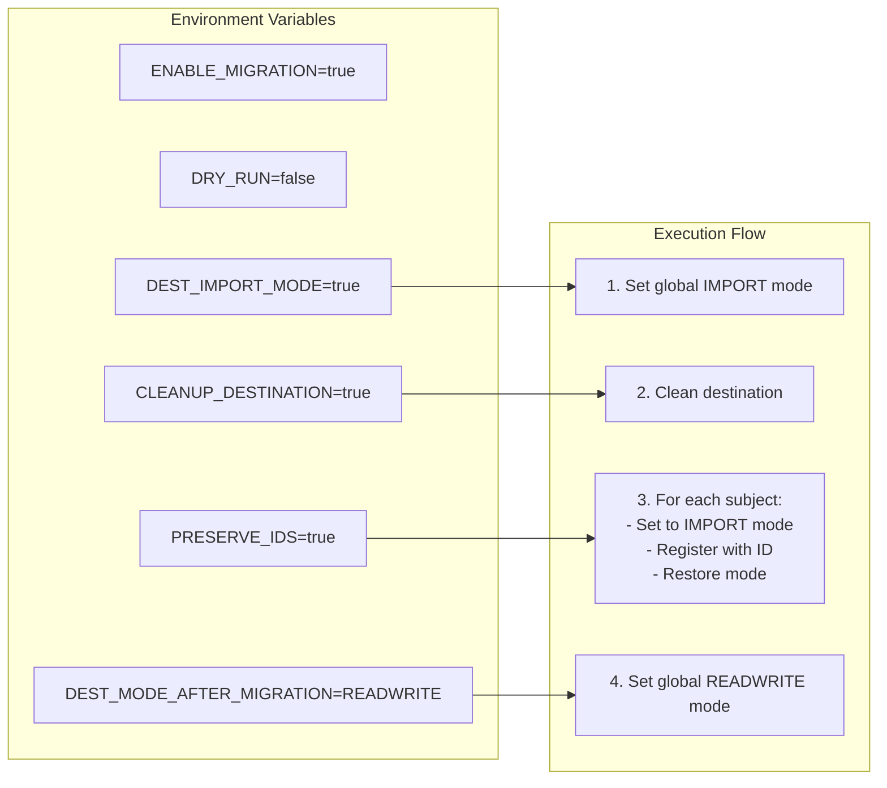

# Schema Registry Migration Flow

## Overall Migration Process

## Schema Migration Process (Per Subject)

## Environment Variables Control Flow

## Mode Hierarchy

## ID Preservation Flow

## Complete Example Flow

