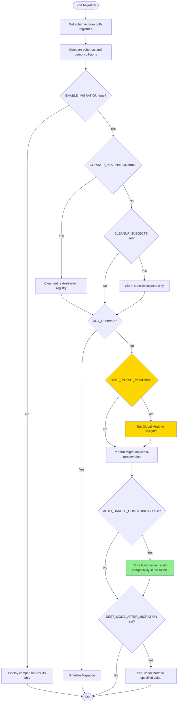
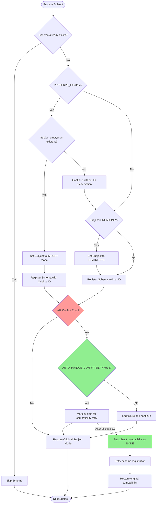
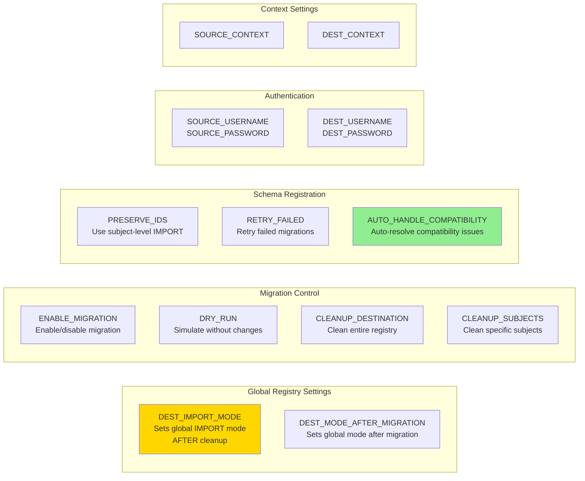
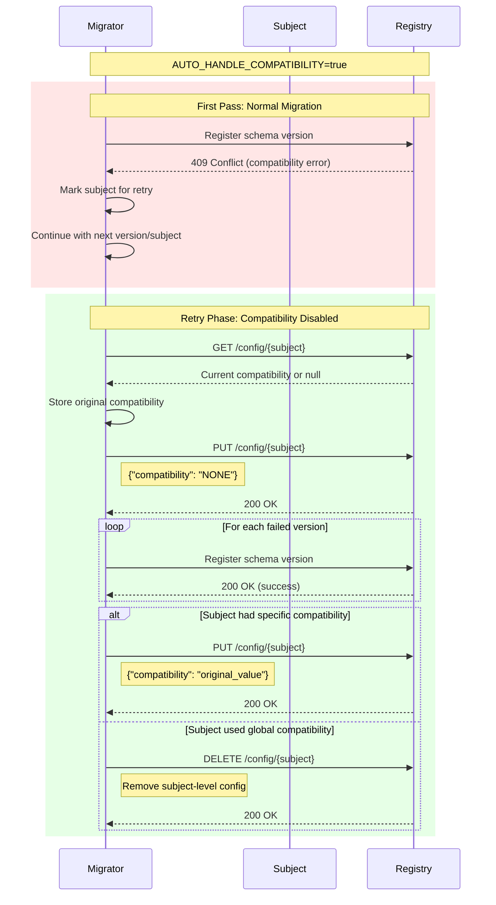
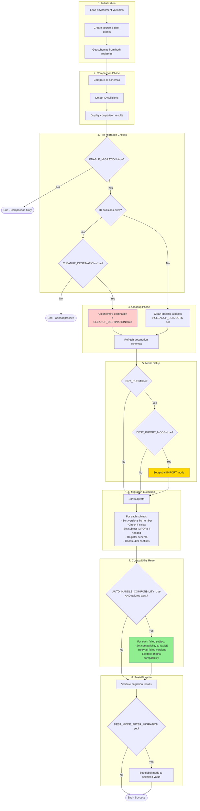

# Schema Registry Migration Flow

## Overall Migration Process



## Schema Migration Process (Per Subject)



## Environment Variables Control Flow



## Mode Hierarchy


## ID Preservation Flow


## Schema-Level Migration Flow (Within a Subject)


## Subject and Schema Processing Order


## Detailed Schema Migration Example


## Schema Data Structure and Ordering


## Key Points About Schema Ordering


## Troubleshooting Version Mismatches

### Common Scenario: Schema Divergence


### Diagnosis Flow


### Debugging Commands

To diagnose version mismatches, you can:

1. **List all versions in both registries**:
```bash
# Source
curl -u $SOURCE_USERNAME:$SOURCE_PASSWORD \
  $SOURCE_SCHEMA_REGISTRY_URL/subjects/YOUR_SUBJECT/versions

# Destination  
curl -u $DEST_USERNAME:$DEST_PASSWORD \
  $DEST_SCHEMA_REGISTRY_URL/subjects/YOUR_SUBJECT/versions
```

2. **Compare specific version schemas**:
```bash
# Get schema from source version 9
curl -u $SOURCE_USERNAME:$SOURCE_PASSWORD \
  $SOURCE_SCHEMA_REGISTRY_URL/subjects/YOUR_SUBJECT/versions/9 | jq .

# Get schema from destination version 9
curl -u $DEST_USERNAME:$DEST_PASSWORD \
  $DEST_SCHEMA_REGISTRY_URL/subjects/YOUR_SUBJECT/versions/9 | jq .
```

3. **Check compatibility**:
```bash
# Test if source schema is compatible with destination
curl -X POST -u $DEST_USERNAME:$DEST_PASSWORD \
  -H "Content-Type: application/json" \
  -d '{"schema": "YOUR_SOURCE_SCHEMA_HERE"}' \
  $DEST_SCHEMA_REGISTRY_URL/compatibility/subjects/YOUR_SUBJECT/versions/latest
```

### Resolution Strategies


### Example: Handling the Reported Issue

For the `payment-transactionPaymentTransactionEvents` case:


### Practical Example: Resolving Version Mismatches

For the reported issue with `payment-transactionPaymentTransactionEvents`:

#### Option 1: Clean Only the Problematic Subject
```bash
# Set environment variables
export CLEANUP_SUBJECTS="payment-transactionPaymentTransactionEvents"
export PERMANENT_DELETE=true
export ENABLE_MIGRATION=true
export DRY_RUN=false

# Run migration - this will:
# 1. Delete only the specified subject
# 2. Re-migrate it from source
python schema_registry_migrator.py
```

#### Option 2: Investigate the Differences First
```bash
# Run comparison only to see detailed differences
export ENABLE_MIGRATION=false
python schema_registry_migrator.py

# The enhanced error reporting will show:
# - Which fields differ between versions
# - Namespace differences
# - Type mismatches
```

#### Option 3: Clean Multiple Problem Subjects
```bash
# If you have multiple subjects with issues
export CLEANUP_SUBJECTS="subject1,subject2,subject3"
export PERMANENT_DELETE=true
export ENABLE_MIGRATION=true
export DRY_RUN=false

python schema_registry_migrator.py
```

## Compatibility Handling Flow



## Key Points About Schema Ordering


## Complete Execution Order


